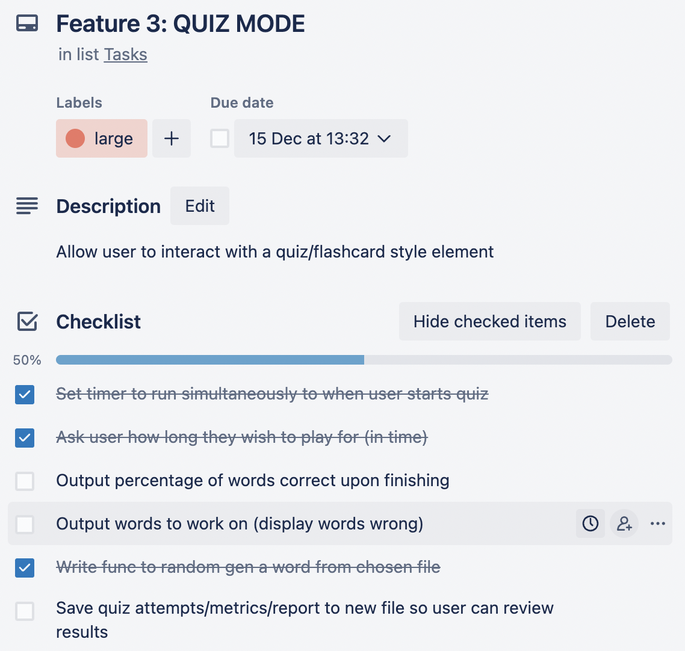
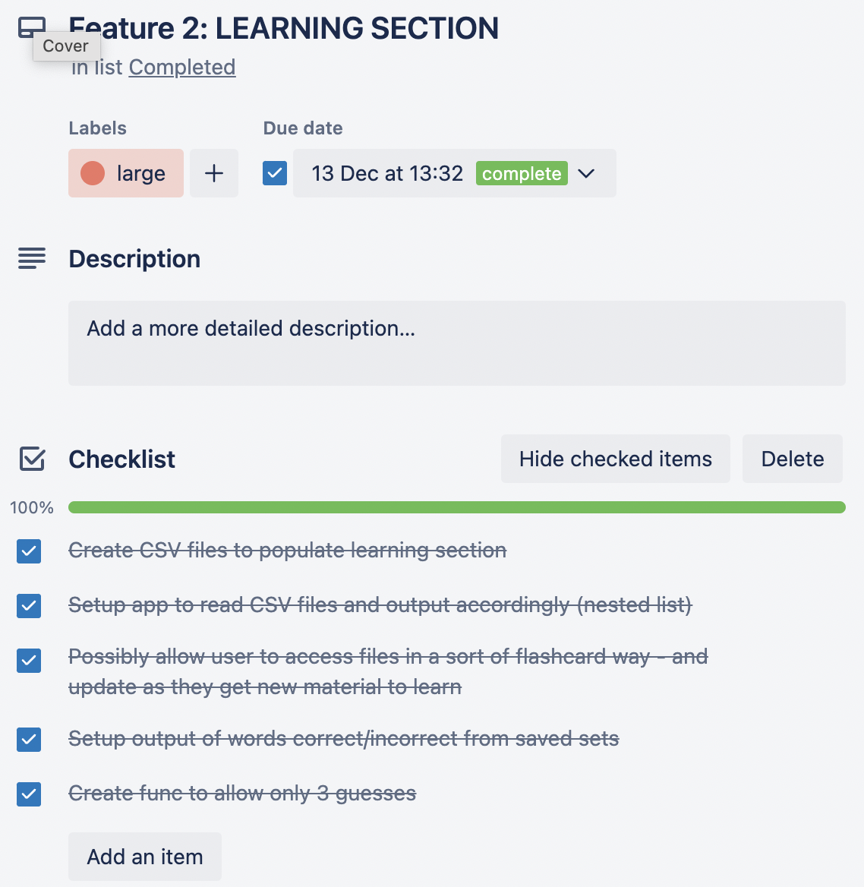
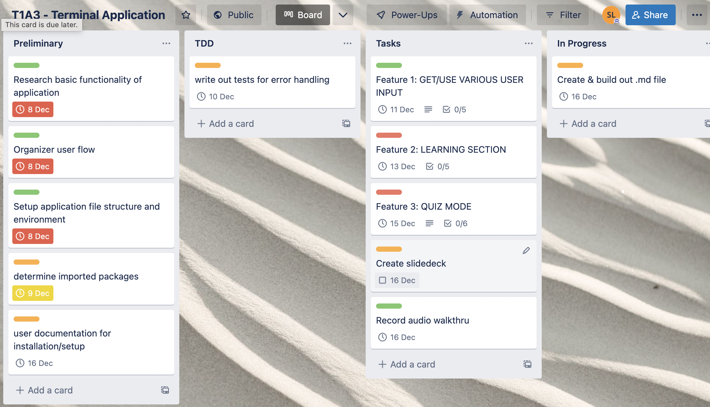

# Translator and Language Learning Terminal Application

### Sources Used:
- CSV docs populated via https://copylists.com/french/list-basic-french-words/#google_vignette
- 
- 

### gitHub Repository:
Check out my gitHub repository here: [Github repo](https://github.com/sarahhlandis/Terminal_Application)

### Style Guide:
This terminal application was made in accordance with the PEP8 styleguide.
It features 

### Application Features
1. Use of various user input throughout the program
- The app will require user input at various point throughout the app both in terms of navigating thru the application as well as responding to application prompts. 
- Upon opening the application, the user will be required to input which mode they wish to enter: Translation, Learning, or Quiz mode.
- Based on this choice, the application will then enter the chosen mode.
- The translation mode will simply allow the user to input their desired text, select which language they wish to translate to, and then translate accordingly.

2. Learning Mode
- The learning mode will allow the user to learn specific words from their relevant course learning files (in CSV file format).
- The user will specify which language they wish to study from (i.e. if they wish to study from english words, they will have to input the french translations and vice versa).
- The user will have the opportunity to practice the words in a sort of flashcard style way, where a word will be displayed and the user will have to enter the translation. The user will be alotted 3 tries to correctly guess the word.
- Upon exiting this mode, the application will output the user's progress, in terms of a percentage (%) of words completed (gone through). It will also display which words the user needs to work on in terms of displaying incorrectly guessed words.

3. Quiz Mode
- The Quiz mode can be accessed at any time from either of the other two modes.
- Quiz mode offers the user the chance to practice the words they've learned with an added time component.
- The user can specify how long they wish to play using a built-in timer (in seconds).
- This mode will randomly generate a word from the file that the user has chosen, and require them to correctly translate, with one guess per question
- Upon finishing the quiz, the application will generate a quiz report file which the user can take a look at.

Things to note: 
- All sections will be able to be accessed internally from any of the other modes.
- At any given input point, the user can also exit completely or return to the home of the program if they wish.

### Implementation Plan
- Feature 1: I plan to prioritize the user input functionality first and foremost, as this is integral to the application running smoothly. Feature 1 will also include the basic translation mode as well.
- Feature 2: I plan to focus on the learning mode once the main "interface" is complete. Once I have created the logic for gathering file information and transferring it into the nested list, I can reuse this for the quiz mode.
- Feature 3: The quiz mode will be implemented a step behind the learning mode as the logic required is similar to that of the learning mode. I also need to look into running a timer simulatenously to when the user "starts" the quiz.

Changes along the way (as of Dec 13):

Changes along the way (as of Dec 15):

#### Poject Management
- I chose to use Trello to manage this project. Please see below images of the implementation plan (with dates) I intend to follow in terms of building out the features of the application.

Progress as of Sat Dec 10
    

Progress as of Tues Dec 13
    

Progress as of Thurs Dec 15
    

### Help Documentation and Installation Guide
1. Set Up Instructions
    1. To start, please download all the files in this repository to your desktop.
    2. 
2. Required Dependencies
3. System Requirements
4. Command Line Arguments

